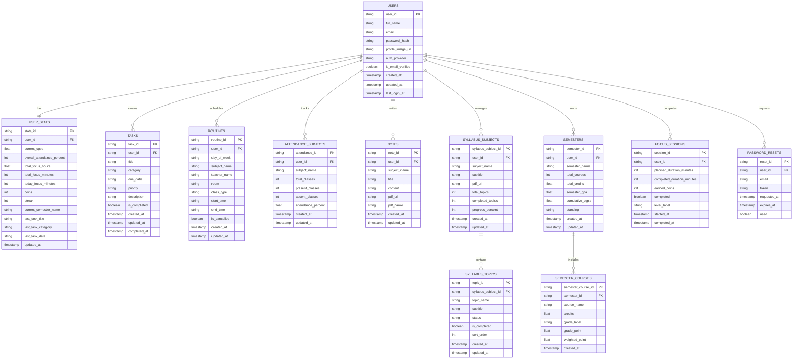

# Student Assistant App ER Diagram

## Full Logical ER Diagram



## Firestore Structure

```text
users/{userId}
users/{userId}/stats/summary
users/{userId}/tasks/{taskId}
users/{userId}/routines/{routineId}
users/{userId}/attendanceSubjects/{attendanceId}
users/{userId}/notes/{noteId}
users/{userId}/syllabusSubjects/{subjectId}
users/{userId}/syllabusSubjects/{subjectId}/topics/{topicId}
users/{userId}/semesters/{semesterId}
users/{userId}/semesters/{semesterId}/courses/{courseId}
users/{userId}/focusSessions/{sessionId}
users/{userId}/passwordResets/{resetId}
```
